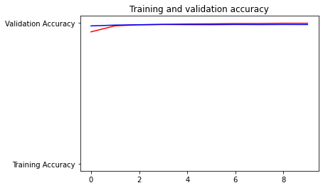

# Classificador de imagens de cães e gatos 

## Esse projeto é baseado em diversos materiais:  
[how-to-develop-a-convolutional-neural-network-to-classify-photos-of-dogs-and-cats](https://machinelearningmastery.com/how-to-develop-a-convolutional-neural-network-to-classify-photos-of-dogs-and-cats/)  
[Xception fine-tuned](https://codelabs.developers.google.com/codelabs/keras-flowers-squeezenet/#7)  
[github DogorCat](https://github.com/kayveen/DogorCat)  
[Keras rest api](https://blog.keras.io/building-a-simple-keras-deep-learning-rest-api.html)  

## VISÃO GERAL DO PROJETO  
Esse projeto tem o objetivo de construir uma rede neural para determinar se uma imagem fornecida é de um cachorro ou gato(aprendizado supervisionado).   
Foi utiliado um modelo pré-treinado chamado Xception, para realizar uma técnica conhecida como transferencia de aprendizado(transfer learning). Em aprendizado profundo, uma rede neural convolucional(convolutional neural network) é utilizada em tarefas de visão computacional.  
O framework utilizado foi o Keras e Tensorflow para a rede neural e uma página com o framework Flask foi construido para os facilitar o teste de imagens.

## Dataset  
O conjunto de dados Kaggle fornecido pela Microsoft Research,  
que contém 25 mil imagens de cães e gatos com as identificações.  
https://www.kaggle.com/c/dogs-vs-cats/data

## Resultados  
A precisão encontrada nesse trabalho foi de 99.79% no treino e 98.8% nos testes.

## Site:
- https://work-in-my-machine.herokuapp.com/  